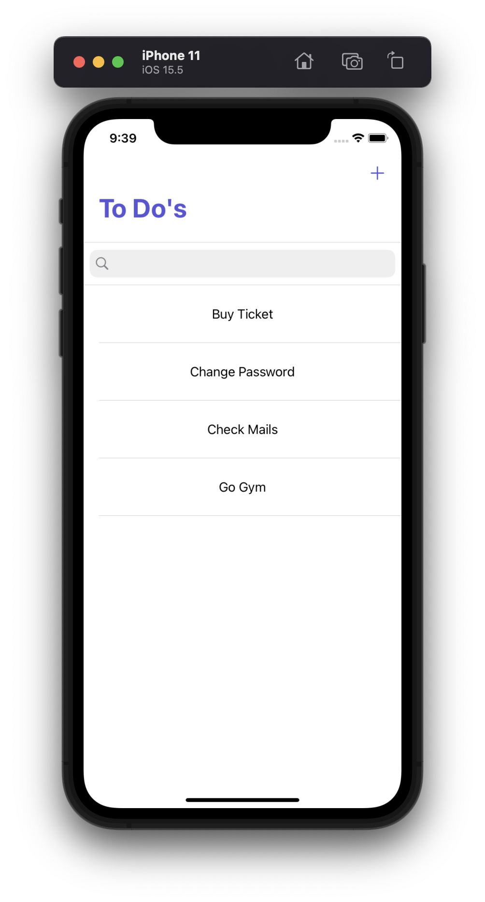
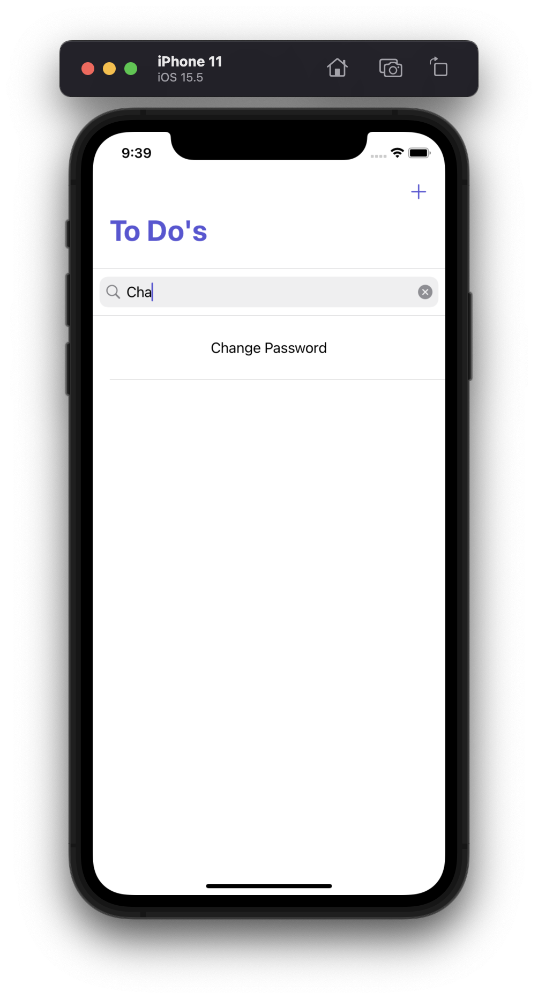
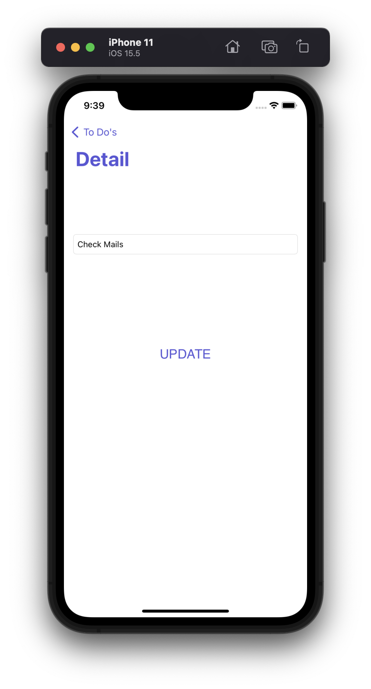
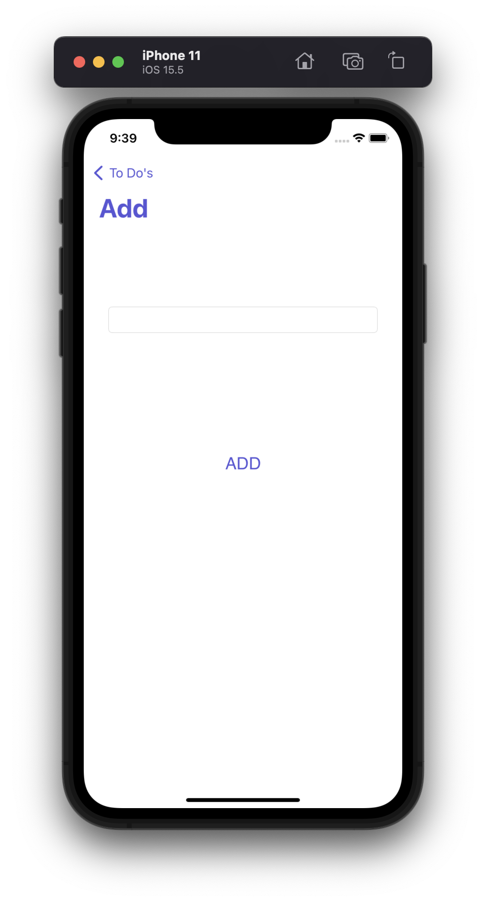

# TO DO APP

## Screenshots

## Features

- Add todo.
- Delete todo.
- Update todo.
- Save datas on local database.
- 
## Tech

Dillinger uses a number of open source projects to work properly:

- SqfLite
- Swift

## License
MIT

